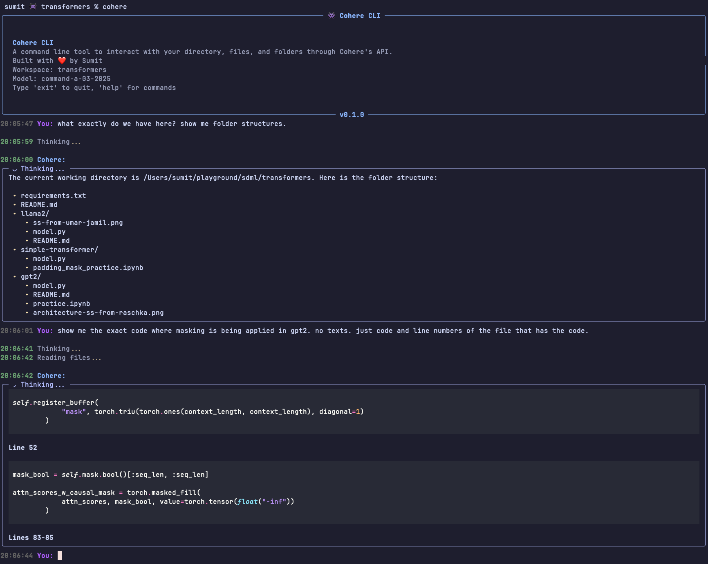

# Cohere Terminal Tool

Your friendly AI assistant that lives inside your terminal and uses Cohere's latest Command-A model to interact with your directory, files, and code.

Inspired by Claude Code. Built with Cohere ❤️.

  




## Features

- **Live Streaming Responses** - See AI responses in real-time with proper markdown formatting
- **Rich Markdown Support** - Code highlighting with GitHub Dark theme, tables, lists, and more
- **File Access** - Read files from your workspace to provide context to the AI
- **Workspace Awareness** - AI understands your current directory structure
- **Modern Terminal UI** - Beautiful styling with Rich library
- **Command History** - Navigate through previous commands

## Installation

### Prerequisites

- Python 3.9+
- uv
- Cohere API key (get it [here](https://dashboard.cohere.com/api-keys))

### Installation

1. Clone the repository:
   ```bash
   git clone https://github.com/sumitdotml/cohere-cli.git
   cd cohere-cli
   ```

2. Set up your Cohere API key in a `.env` file in the project root:
   ```bash
   echo "COHERE_API_KEY=your-api-key-here" > .env
   ```

3. Create and activate a virtual environment:
   ```bash
   uv venv
   source .venv/bin/activate
   ```
   
4. Install the package and dependencies:
   ```bash
   uv pip install -e .
   ```

## Running the tool

### Globally

The included `cohere-wrapper.sh` script allows you to run the tool from anywhere.

1. **Make the wrapper executable:**
   ```bash
   chmod +x cohere-wrapper.sh
   ```

2. **Link the wrapper to your PATH:** Create a symbolic link named `cohere` pointing to the wrapper script in a directory within your system's `PATH` (e.g., `/usr/local/bin` is common).
   ```bash
   # Example: Linking to /usr/local/bin
   # Ensure you are in the project directory first!
   # Make sure you have write permissions or use sudo
   sudo ln -s "$(pwd)/cohere-wrapper.sh" /usr/local/bin/cohere
   ```
   *(Replace `/usr/local/bin` if you use a different directory in your PATH)*

3. **Run from anywhere:** Now you can simply type `cohere` in any terminal window to launch the tool. The wrapper script handles activating the correct environment and finding the `.env` file within the project directory.

### Locally

1. Ensure you have activated the virtual environment:
   ```bash
   source .venv/bin/activate
   ```

2. Make the wrapper executable:
   ```bash
   chmod +x cohere-wrapper.sh
   ```

3. Run the tool:
   ```bash
   ./cohere-wrapper.sh
   ```

## Commands

During chat, you can use these commands:

- `exit` - Exit the chat
- `help` - Show help message
- `clear` - Clear the screen
- `rescan` - Refresh workspace context

## How It Works

The client connects to Cohere's API and provides these key capabilities:

1. **Workspace Scanning** - Automatically scans your current directory for relevant files
2. **File Reading** - Allows Cohere to read specific files for better context
3. **Streaming Responses** - Shows responses as they're generated with live markdown formatting
4. **Rich Terminal UI** - Provides a beautiful, modern interface for chatting

## Limitations

This tool can scan and read files from the current directory. However, the current version cannot edit the files. Maybe there's a way to do that, but I'll think about it later since I've spent too much time on this already.

## Contributing

Contributions are welcome! Please open an issue or submit a pull request (especially for the file editing part).

## License

MIT License. See [LICENSE](LICENSE) for more details.

## Acknowledgements

- [Claude Code](https://docs.anthropic.com/en/docs/agents-and-tools/claude-code/overview) for the inspiration
- [Ivan Zhang](https://x.com/1vnzh) for generously providing me with enough Cohere credits to feed my family
